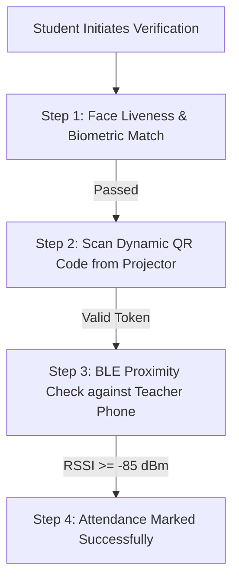

# Smart Attendance System

A secure, multi-factor attendance verification platform built with **Flutter**, **Google ML Kit**, **Bluetooth Low Energy (BLE)**, and **Dynamic Rolling QR Codes**. Designed to prevent proxy attendance through three layers of verification: **Face Biometrics + Liveness**, **Dynamic Classroom QR**, and **Bluetooth Proximity**.

---

## 🌟 Key Features

### 1. 🎭 Biometric Face Recognition & Liveness Detection
- **On-Device Machine Learning**: Uses **Google ML Kit Face Detection** to process facial landmarks locally with low latency.
- **Liveness Verification**: Ensures the user is real and physically present by prompting interactive micro-actions (e.g., eye blink & smile checks).
- **Geometric Landmark Matching**: Extracts facial ratio vectors ($r_1, r_2$) and compares them against enrolled student templates.

### 2. 📱 Bluetooth Low Energy (BLE) Proximity Verification
- **Teacher Beacon Mode**: Teacher devices act as a BLE Peripheral broadcasting a classroom beacon signal (`SmartAtt_[CLASS_CODE]`).
- **Student Scanner**: Student devices scan for the teacher's BLE signal and measure signal strength (RSSI $\ge -85\text{ dBm}$) to verify physical presence within the classroom (~8-10m).

### 3. ⏱️ Dynamic Rolling QR Code System
- **Time-Based OTP**: Generates dynamic QR codes linked to session IDs that update periodically to prevent screenshot sharing or remote check-ins.
- **Projector Web Dashboard**: Web interface for teachers to project rolling QR codes and display real-time check-in stats.

---

## 📁 Repository Structure

```
Smart_Attendance/
├── mobile/                  # Flutter Cross-Platform Application (Android / iOS)
│   ├── android/             # Native Android configuration (ProGuard, Gradle, Permissions)
│   ├── ios/                 # Native iOS configuration
│   ├── lib/
│   │   ├── main.dart        # Application Entry Point & Navigation Routes
│   │   ├── screens/         # UI Screens (Login, Student Verification Flow, Teacher Host)
│   │   └── services/        # Backend API Services & Firestore Integration
│   └── pubspec.yaml         # Flutter Dependencies
├── backend/                 # FastAPI / Python Backend Server
│   ├── main.py              # REST API endpoints & Session/Check-in logic
│   ├── database.py          # SQLite database connection & models
│   ├── models.py            # Pydantic data schemas
│   └── requirements.txt     # Python Dependencies
├── web/                     # Projector Web Dashboard (HTML5 / JavaScript)
│   ├── index.html           # Projector display UI
│   └── app.js               # Dynamic QR code renderer & polling engine
└── firebase.json            # Firebase Configuration
```

---

## ⚙️ Tech Stack & Dependencies

### Mobile App (Flutter)
- **SDK**: Dart `^3.0.0` / Flutter `3.x`
- **Biometrics**: `google_mlkit_face_detection: ^0.12.0`
- **Camera & Scanning**: `camera: ^0.10.5+9`, `mobile_scanner: ^4.0.1`
- **Bluetooth**: `flutter_blue_plus: ^1.31.11` (Student Scanner), `flutter_ble_peripheral: any` (Teacher Peripheral)
- **Backend & Cloud**: `firebase_core`, `firebase_auth`, `cloud_firestore`, `http`

### Backend (Python)
- **Framework**: FastAPI / Uvicorn
- **Database**: SQLite / SQLAlchemy
- **Security**: Passlib (Bcrypt), PyJWT

---

## 🚀 Getting Started

### 1. Prerequisites
- **Flutter SDK** (v3.0.0 or higher)
- **Android Studio** / Android SDK (v23+ `minSdkVersion`)
- **Python 3.10+** (for backend API)
- **Google Play Services** on testing devices

---

### 2. Backend Setup
```bash
cd backend

# Create a virtual environment (optional)
python -m venv venv
source venv/bin/activate  # On Windows: venv\Scripts\activate

# Install dependencies
pip install -r requirements.txt

# Start the server
uvicorn main:app --reload --host 0.0.0.0 --port 8000
```
> The API server will run at `http://localhost:8000`.

---

### 3. Mobile App Setup (Flutter)
```bash
cd mobile

# Get packages
flutter pub get

# Run on a connected physical device (recommended for Camera/BLE)
flutter run

# Build Release APK
flutter build apk --release
```
> **Output Release Location**: `mobile/build/app/outputs/flutter-apk/app-release.apk`

---

### 4. Web Dashboard Setup
Simply open `web/index.html` in any modern browser, or host it using a local HTTP server:
```bash
cd web
npx serve .
```

---

## 🔧 Release Build Configuration (R8 / ProGuard)

Release APKs enable **R8 code shrinking and minification**. To prevent ML Kit and BLE native reflection classes from being stripped:

Custom ProGuard rules are configured in [`mobile/android/app/proguard-rules.pro`](file:///c:/Users/vmbad/Downloads/Smart_Attendance/mobile/android/app/proguard-rules.pro):

```proguard
# Keep Google ML Kit
-keep class com.google.mlkit.** { *; }
-keep interface com.google.mlkit.** { *; }
-dontwarn com.google.mlkit.**

# Keep Google Play Services internal ML Kit classes
-keep class com.google.android.gms.internal.mlkit_** { *; }
-dontwarn com.google.android.gms.internal.mlkit_**
-keep class com.google.android.gms.** { *; }

# Keep BLE Plugins
-keep class com.bosoco.flutter_blue_plus.** { *; }
-keep class com.github.jasonross.flutter_ble_peripheral.** { *; }

# Keep Native Methods
-keepclasseswithmembernames class * {
    native <methods>;
}
```

---

## 📱 Verification Flow Summary



---

## 📄 License

Distributed under the MIT License. See `LICENSE` for details.
